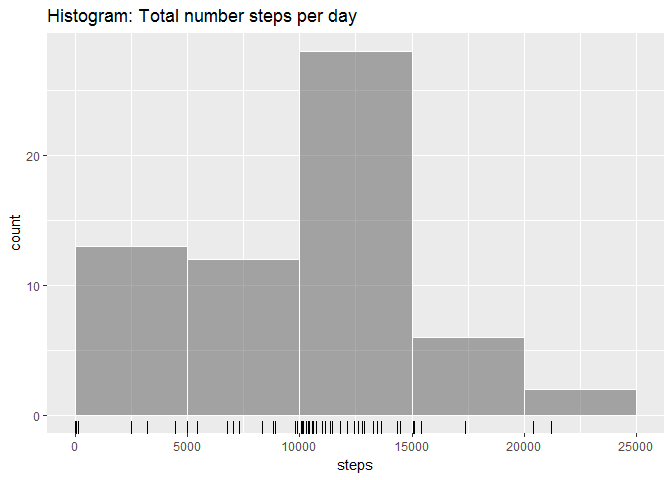

# Reproducible Research: Peer Assessment 1


## Load library

```r
library(ggplot2)
library(scales)
library(knitr)
```

## Loading and preprocessing the data

```r
unzip("./activity.zip")
activity <- read.csv("activity.csv")
#cast character date
activity$date <- as.Date(activity$date)
summary(activity)
```

```
##      steps             date               interval     
##  Min.   :  0.00   Min.   :2012-10-01   Min.   :   0.0  
##  1st Qu.:  0.00   1st Qu.:2012-10-16   1st Qu.: 588.8  
##  Median :  0.00   Median :2012-10-31   Median :1177.5  
##  Mean   : 37.38   Mean   :2012-10-31   Mean   :1177.5  
##  3rd Qu.: 12.00   3rd Qu.:2012-11-15   3rd Qu.:1766.2  
##  Max.   :806.00   Max.   :2012-11-30   Max.   :2355.0  
##  NA's   :2304
```


## What is mean total number of steps taken per day?


```r
# 1. Calculate the total number of steps taken per day
tots <- setNames(aggregate(activity$steps,by=list(activity$date), sum, na.rm =TRUE), c("date","steps"))
```


```r
# 2. Make a histogram of the total number of steps taken each day (If you do not understand the difference between a histogram and a barplot, research the difference between them.)
toth <- ggplot(data=tots, aes(steps)) + geom_histogram(breaks=seq(0,25000,by=5000), alpha=.5, col="white") + labs(title="Histogram: Total number steps per day") + geom_rug()
print(toth)
```

<!-- -->


```r
# 2. Make a barplot
totbp <- ggplot(data=tots, aes(x=date, y=steps)) + geom_bar(stat='identity') + scale_x_date(date_breaks = '1 week') + theme(axis.text.x = element_text(angle=90, vjust=0.5)) + labs(title="Barplot: Total number steps by day")
print(totbp)
```

<!-- -->


```r
# 3. Calculate and report the mean and median of the total number of steps taken per day
mea <- mean(tots$steps)
med <- median(tots$steps)
```
The mean and median of the total number of steps taken per day are **9354.23** and **10395**


## What is the average daily activity pattern?

```r
# 1. Make a time series plot (i.e. type = "l") of the 5-minute interval (x-axis) and the average number of steps taken, averaged across all days (y-axis)
meansi <- setNames(aggregate(activity$steps,by=list(activity$interval), mean, na.rm =TRUE), c("interval","steps"))

meanl <- ggplot(data=meansi, aes(x=interval, y=steps)) + geom_line() +  labs(title="Average daily activity pattern")
print(meanl)
```

<!-- -->

Which 5-minute interval, on average across all the days in the dataset, contains the maximum number of steps ?


```r
maxsi <- subset(meansi, steps==max(meansi$steps))
```
5-minute interval **835** contains the maximun number of steps, **206.1698**, on average across all the days in the dataset


## Imputing missing values


```r
# 1. Calculate and report the total number of missing values in the dataset (i.e. the total number of rows with NAs)
totna <- sum(is.na(activity$steps))
```
The total number of obs. with NAs is **2304** searched in steps variable.


```r
# 2. Devise a strategy for filling in all of the missing values in the dataset. The strategy does not need to be sophisticated. For example, you could use the mean/median for that day, or the mean for that 5-minute interval, etc.
```
I use the mean for that 5-minute interval: meansi variable just calculated


```r
# 3. Create a new dataset that is equal to the original dataset but with the missing data filled in.

activityc <- read.csv("activity.csv")
#cast character date
activityc$date <- as.Date(activityc$date)

for (i in seq_along(activityc$steps)){
  
  if (is.na(activityc$steps[i])){
  activityc$steps[i] <- subset(meansi, meansi$interval==activityc$interval[i])$steps
    }
  
}

summary(activityc)
```

```
##      steps             date               interval     
##  Min.   :  0.00   Min.   :2012-10-01   Min.   :   0.0  
##  1st Qu.:  0.00   1st Qu.:2012-10-16   1st Qu.: 588.8  
##  Median :  0.00   Median :2012-10-31   Median :1177.5  
##  Mean   : 37.38   Mean   :2012-10-31   Mean   :1177.5  
##  3rd Qu.: 27.00   3rd Qu.:2012-11-15   3rd Qu.:1766.2  
##  Max.   :806.00   Max.   :2012-11-30   Max.   :2355.0
```


```r
# 4. Make a histogram of the total number of steps taken each day and Calculate and report the mean and median total number of steps taken per day. Do these values differ from the estimates from the first part of the assignment? What is the impact of imputing missing data on the estimates of the total daily number of steps?

totsc <- setNames(aggregate(activityc$steps,by=list(activityc$date), sum), c("date","steps"))

tothc <- ggplot(data=totsc, aes(steps)) + geom_histogram(breaks=seq(0,25000,by=5000), alpha=.5, col="white") + labs(title="Histogram: Total number steps per day with imputed values") + geom_rug()
print(tothc)
```

<!-- -->


```r
# Make a barplot

totbpc <- ggplot(data=totsc, aes(x=date, y=steps)) + geom_bar(stat='identity') + scale_x_date(date_breaks = '1 week') + theme(axis.text.x = element_text(angle=90, vjust=0.5)) + labs(title="Barplot: Total number steps by day with imputed values")
print(totbpc)
```

<!-- -->


```r
meac <- mean(totsc$steps)
medc <- median(totsc$steps)
```
The mean and median of the total number of steps taken per day are **10766.19** and **10766.19**

Do these values differ from the estimates from the first part of the assignment?
Values differ, absolute mean by **1411.959** and absolute median by **371.1887**

What is the impact of imputing missing data on the estimates of the total daily number of steps?


```r
totall <- setNames(cbind(tots,totsc$steps), c("date","stepsna","stepswna"))
#only day impacted 
kable(subset(totall,(stepswna-stepsna)>0), format = "markdown", caption="Days impacted by imputing missing data", col.names = c("date","total steps with NA","total steps after imputing missing data"))
```


|   |date       | total steps with NA| total steps after imputing missing data|
|:--|:----------|-------------------:|---------------------------------------:|
|1  |2012-10-01 |                   0|                                10766.19|
|8  |2012-10-08 |                   0|                                10766.19|
|32 |2012-11-01 |                   0|                                10766.19|
|35 |2012-11-04 |                   0|                                10766.19|
|40 |2012-11-09 |                   0|                                10766.19|
|41 |2012-11-10 |                   0|                                10766.19|
|45 |2012-11-14 |                   0|                                10766.19|
|61 |2012-11-30 |                   0|                                10766.19|


## Are there differences in activity patterns between weekdays and weekends?


```r
# 1. Create a new factor variable in the dataset with two levels - "weekday" and "weekend" indicating whether a given date is a weekday or weekend day.

# Use the dataset with the filled-in missing values for this part: activityc
activityc$daytype <- factor(ifelse(as.POSIXlt(activityc$date)$wday %in% c(0,6),"weekend","weekday"))
```


```r
# 2. Make a panel plot containing a time series plot (i.e. type = "l") of the 5-minute interval (x-axis) and the average number of steps taken, averaged across all weekday days or weekend days (y-axis).

meansdt <- aggregate(steps ~ daytype + interval, mean, data=activityc)
ggdaytype <- ggplot(meansdt, aes(x=interval,y=steps)) + facet_grid(daytype ~ .) + geom_line() + labs (y="Number of steps")
print(ggdaytype)
```

<!-- -->
